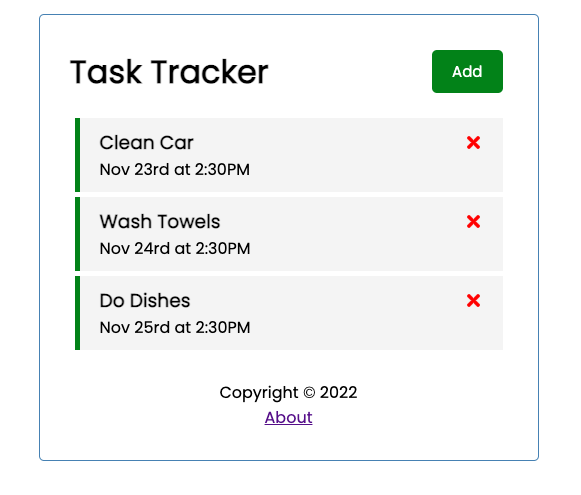
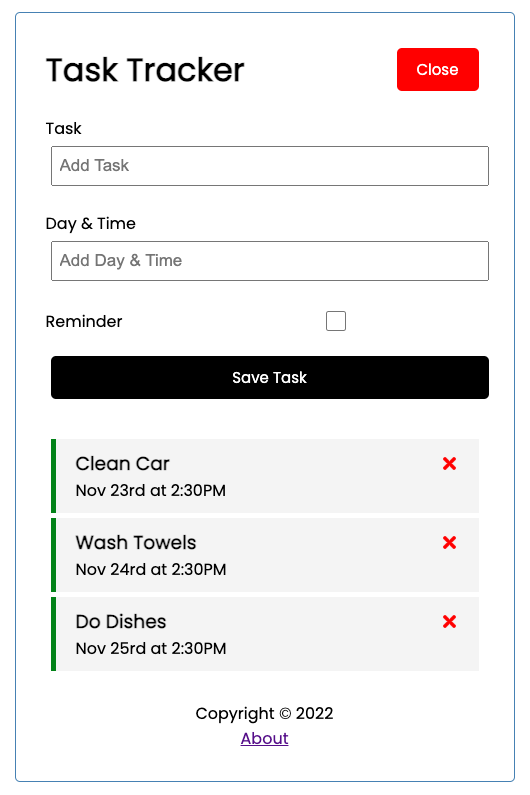
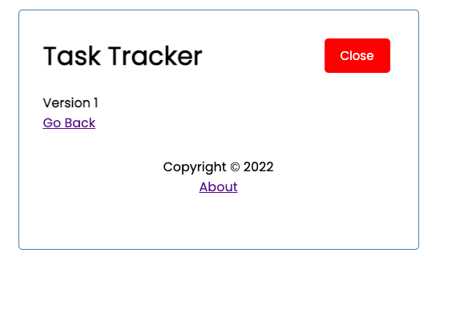

# React-Task-Tracker

## Index

1. [Description](#description)
2. [Technology](#technology)
3. [ScreenShots](#screenshots)
4. [Installation](#installation)
5. [Collaborators](#collaborators)
6. [Resources](#resources)
4. [License](#license)

## Description

A simple task tracker that can be used to create tasks, read tasks, update tasks, and delete tasks. Added an about page to practice with react-router-dom package, but it is kind of pointless for this application.

## Technology

1. `React` 
2. `Git/Github` 
3. `JSON Server`
4. `CSS`
5. `Node.js`

## ScreenShots

## Tests

No tests at this time.

## Installation

Setup: 
- (1) Fork the repo, (2) Clone the forked repo locally, (3) Run "npm install" (to install the dependencies).
- npm run start

## Collaborators

1.  [Alex Cleveland - GitHub Profile](https://github.com/AClevel5)

## Resources

1. GitHub Repo: <https://github.com/AClevel5/React-Task-Tracker>

## License

This project is licensed under the terms of the The MIT License. Please click on the license badge for more information.
